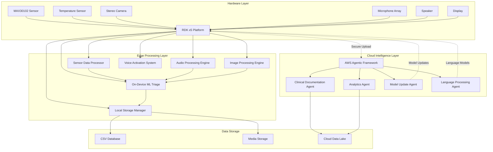
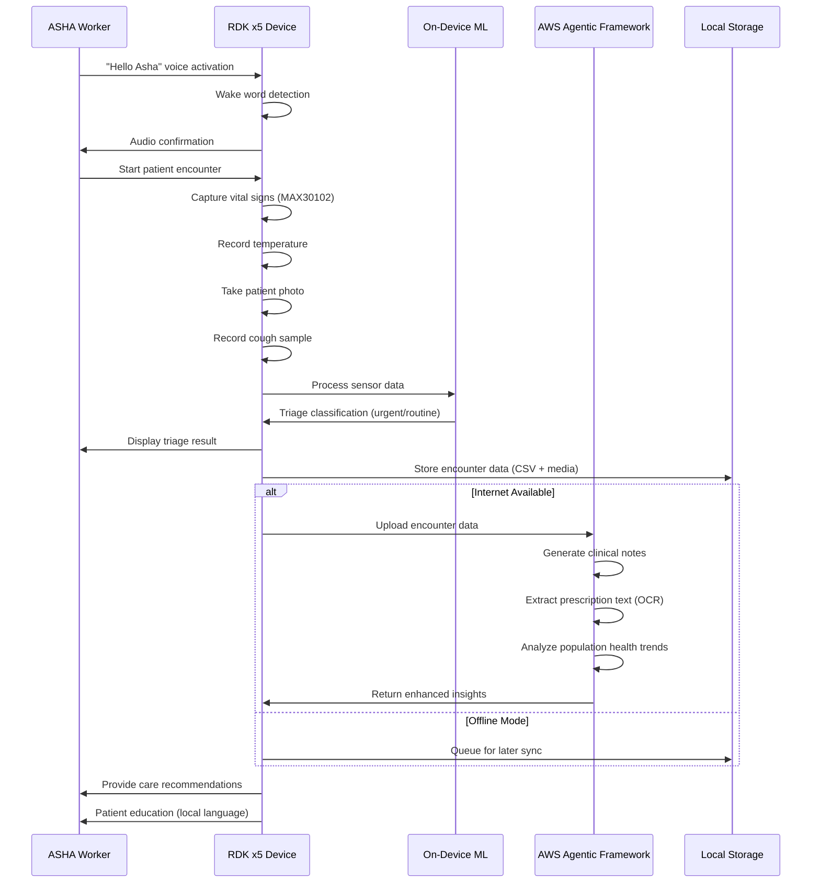
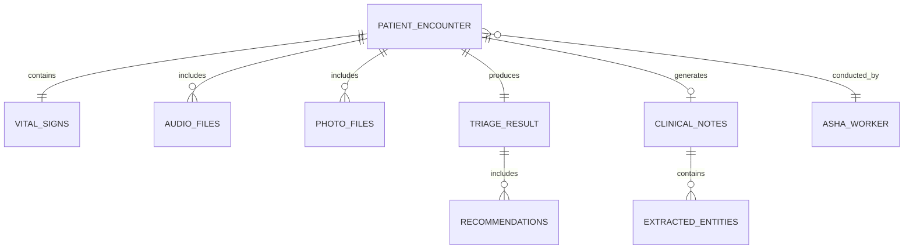

# Design Document: Pocket ASHA

## Overview

The Pocket ASHA system is a comprehensive multimodal healthcare triage device built on the RDK x5 platform, designed specifically for rural healthcare workers in India. The system integrates hardware sensors, on-device machine learning, cloud-based intelligent processing, and multilingual voice interfaces to provide a complete healthcare workflow solution.

The architecture follows a hybrid edge-cloud approach where critical functions like vital sign monitoring, triage classification, and basic voice interaction operate offline on the RDK x5, while advanced clinical documentation, complex analytics, and model updates leverage AWS Agentic Framework capabilities in the cloud.

Key design principles include:
- **Offline-first operation** for reliable rural deployment
- **Multilingual support** for diverse Indian language requirements  
- **Privacy-by-design** with local data encryption and secure cloud transmission
- **Modular architecture** enabling independent component updates and maintenance
- **Healthcare workflow integration** following established ASHA protocols

## Architecture

The system architecture consists of three primary layers: Hardware Integration Layer, Edge Processing Layer, and Cloud Intelligence Layer, connected through secure communication channels.



### Data Flow Architecture

The system processes multiple data streams concurrently, with different pathways for real-time processing and cloud analytics:



## Components and Interfaces

### Hardware Integration Components

#### Vital Signs Monitor
- **MAX30102 Sensor Interface**: I2C communication at 400kHz, 16-bit ADC resolution
- **Temperature Sensor Interface**: Digital sensor with ±0.2°C accuracy, 1-second response time
- **Sensor Fusion Engine**: Combines multiple vital sign readings for accuracy validation
- **Calibration Manager**: Maintains sensor calibration data and drift compensation

#### Audio Processing System
- **Microphone Array**: Multi-directional capture with noise cancellation for rural environments
- **Audio Codec**: 16kHz sampling rate, 16-bit depth, real-time compression
- **Voice Activity Detection**: Distinguishes speech from background noise up to 60dB
- **Audio Buffer Manager**: Circular buffer system for continuous recording capability

#### Visual Capture System
- **Stereo Camera Controller**: Dual camera coordination for depth perception and image quality
- **Image Processing Pipeline**: Real-time image enhancement, auto-focus, and lighting compensation
- **Photo Storage Manager**: Organized file system with encounter-based folder structure
- **Quality Assessment Engine**: Automatic image quality validation with retake prompts

### Edge Processing Components

#### Voice Activation and Command Processing
```python
class VoiceActivationSystem:
    def __init__(self):
        self.wake_words = ["hello asha", "ok asha"]
        self.intent_engine = IntentRecognitionEngine()
        self.language_detector = LanguageDetector()
    
    def process_audio_stream(self, audio_data):
        # Wake word detection in first two words
        if self.detect_wake_word(audio_data):
            return self.intent_engine.process_command(audio_data)
        return None
    
    def detect_wake_word(self, audio_data):
        words = self.extract_words(audio_data)
        return any("asha" in words[:2] for word in words[:2])
```

#### On-Device Machine Learning Engine
- **Triage Classification Model**: Lightweight neural network optimized for RDK x5 hardware
- **Feature Extraction Pipeline**: Processes vital signs, audio features, and demographic data
- **Inference Engine**: Real-time classification with confidence scoring
- **Model Update Manager**: Handles over-the-air model updates from AWS

#### Local Data Management
- **CSV Database Engine**: Structured storage for patient encounters with ACID properties
- **Media File Manager**: Hierarchical storage system linking photos/audio to encounters
- **Sync Queue Manager**: Manages offline data queuing and cloud synchronization
- **Data Encryption Layer**: AES-256 encryption for all stored patient data

### Cloud Intelligence Components

#### AWS Agentic Framework Integration
The cloud layer leverages AWS Bedrock AgentCore to provide intelligent processing capabilities:

```python
class AWSAgenticFramework:
    def __init__(self):
        self.clinical_agent = ClinicalDocumentationAgent()
        self.analytics_agent = PopulationHealthAgent()
        self.language_agent = MultilingualProcessingAgent()
        self.update_agent = ModelUpdateAgent()
    
    def process_encounter_data(self, encounter_data):
        # Parallel processing by specialized agents
        clinical_notes = self.clinical_agent.generate_notes(encounter_data)
        health_insights = self.analytics_agent.analyze_trends(encounter_data)
        language_support = self.language_agent.process_multilingual_content(encounter_data)
        
        return {
            'clinical_notes': clinical_notes,
            'insights': health_insights,
            'language_data': language_support
        }
```

#### Clinical Documentation Agent
- **Speech-to-Text Processing**: Converts audio recordings to structured text using AWS Transcribe Medical
- **Medical Entity Extraction**: Identifies symptoms, conditions, and medical terminology
- **Clinical Note Generation**: Creates standardized medical documentation following Indian healthcare protocols
- **Prescription OCR**: Extracts text from prescription photos using Amazon Textract

#### Population Health Analytics Agent
- **Trend Analysis Engine**: Identifies health patterns across communities and regions
- **Risk Stratification**: Categorizes patients based on health indicators and demographics
- **Outbreak Detection**: Monitors for unusual disease patterns or health emergencies
- **Resource Optimization**: Provides recommendations for healthcare resource allocation

## Data Models

### Core Data Structures

#### Patient Encounter Record
```python
@dataclass
class PatientEncounter:
    encounter_id: str
    timestamp: datetime
    asha_worker_id: str
    patient_demographics: PatientDemographics
    vital_signs: VitalSigns
    audio_recordings: List[AudioFile]
    photos: List[PhotoFile]
    triage_result: TriageClassification
    clinical_notes: Optional[ClinicalNotes]
    follow_up_required: bool
    sync_status: SyncStatus

@dataclass
class VitalSigns:
    spo2_percentage: float
    heart_rate_bpm: int
    temperature_celsius: float
    measurement_timestamp: datetime
    sensor_confidence: float
    
@dataclass
class TriageClassification:
    urgency_level: str  # "urgent", "routine", "follow_up"
    confidence_score: float
    contributing_factors: List[str]
    recommendations: List[str]
    referral_required: bool
```

#### Local Storage Schema
The CSV database maintains the following structure for efficient querying and synchronization:

```csv
encounter_id,timestamp,asha_worker_id,patient_id,spo2,heart_rate,temperature,triage_level,sync_status,photo_count,audio_count
ENC_001,2024-01-15T10:30:00Z,ASHA_001,PAT_001,98.5,72,98.6,routine,synced,2,1
ENC_002,2024-01-15T11:15:00Z,ASHA_001,PAT_002,89.2,95,101.2,urgent,pending,1,2
```

#### Cloud Data Model
```python
class CloudEncounterRecord:
    def __init__(self):
        self.encounter_metadata = EncounterMetadata()
        self.processed_clinical_notes = ProcessedClinicalNotes()
        self.extracted_insights = HealthInsights()
        self.quality_metrics = QualityMetrics()
        self.population_health_data = PopulationHealthData()
```

### Data Relationships and Integrity



## Correctness Properties

*A property is a characteristic or behavior that should hold true across all valid executions of a system—essentially, a formal statement about what the system should do. Properties serve as the bridge between human-readable specifications and machine-verifiable correctness guarantees.*

Before defining the correctness properties, I need to analyze the acceptance criteria from the requirements to determine which are testable as properties, examples, or edge cases.

### Property 1: Vital Signs Measurement Accuracy
*For any* patient vital sign measurement (SpO₂, heart rate, temperature), the measured values should be within clinically acceptable accuracy ranges (±5 BPM for heart rate, ±0.2°C for temperature, standard pulse oximetry accuracy for SpO₂)
**Validates: Requirements 1.2, 1.3**

### Property 2: Measurement Timing Performance
*For any* vital sign measurement session, the complete measurement process should complete within 30 seconds from sensor placement
**Validates: Requirements 1.1**

### Property 3: Real-time Display Updates
*For any* ongoing vital sign measurement, display updates should occur within acceptable real-time bounds (< 1 second latency)
**Validates: Requirements 1.4**

### Property 4: Abnormal Vital Signs Alert Generation
*For any* vital sign reading outside normal clinical ranges, appropriate visual and audio alerts should be generated immediately
**Validates: Requirements 1.5**

### Property 5: Photo Quality and Organization
*For any* photo capture (prescription or patient), the resulting image should meet quality standards for its intended use (OCR-suitable for prescriptions, identification-suitable for patients) and be stored with proper organization and timestamps
**Validates: Requirements 2.1, 2.2, 2.3, 2.5**

### Property 6: Photo Quality Assessment and Feedback
*For any* photo that fails quality assessment, the system should prompt for retaking with appropriate guidance
**Validates: Requirements 2.4**

### Property 7: Voice Activation and Response
*For any* utterance containing "Hello Asha" or "Ok Asha" in the first two words, the system should activate, provide audio confirmation, and await commands
**Validates: Requirements 3.1, 3.2, 3.3**

### Property 8: Voice Command Processing
*For any* voice command after activation, the system should process the command and determine appropriate actions, requesting clarification when commands are unclear
**Validates: Requirements 3.4, 3.5**

### Property 9: Audio Recording Specifications
*For any* audio recording (cough samples or symptom descriptions), the recording should meet technical specifications (16kHz sampling rate, appropriate duration limits, noise tolerance up to 60dB, compression applied)
**Validates: Requirements 4.1, 4.2, 4.3, 4.5**

### Property 10: Audio Quality Assessment
*For any* audio recording with insufficient quality, the system should prompt for re-recording
**Validates: Requirements 4.4**

### Property 11: Triage Classification Performance
*For any* complete patient data set, triage classification should complete within 10 seconds and operate without internet connectivity
**Validates: Requirements 5.1, 5.3**

### Property 12: Triage Classification Accuracy
*For any* patient case classified as urgent, the system should achieve minimum 90% sensitivity for life-threatening conditions
**Validates: Requirements 5.2**

### Property 13: Triage Output Completeness
*For any* completed triage classification, the output should include clear recommendations, confidence levels, and incorporate all available data (vital signs, audio features, demographics)
**Validates: Requirements 5.4, 5.5**

### Property 14: Cloud Processing Workflow
*For any* patient encounter data uploaded to AWS, the system should initiate intelligent agent processing, generate enhanced insights, and return results to the device
**Validates: Requirements 6.1, 6.2, 6.3**

### Property 15: OCR Processing Capability
*For any* prescription photo processed in the cloud, text extraction should be attempted using OCR capabilities
**Validates: Requirements 6.4**

### Property 16: Conversation Context Preservation
*For any* series of patient interactions, conversation context should be maintained across multiple interactions
**Validates: Requirements 6.5**

### Property 17: Local Data Storage Integrity
*For any* patient encounter, data should be stored in proper CSV format with organized media files, maintaining referential integrity between records and media files, including all required fields
**Validates: Requirements 7.1, 7.2, 7.3, 7.4**

### Property 18: Storage Capacity Management
*For any* local storage approaching capacity limits, users should receive alerts and synchronization suggestions
**Validates: Requirements 7.5**

### Property 19: Clinical Documentation Generation
*For any* encounter data processed in the cloud, structured medical documentation should be generated within 2 minutes, including all required information categories and following medical documentation standards
**Validates: Requirements 8.1, 8.3, 8.4**

### Property 20: Medical Information Extraction
*For any* audio recording processed in the cloud, relevant medical information should be extracted using speech recognition
**Validates: Requirements 8.2**

### Property 21: Offline Data Queuing
*For any* encounter data when internet connectivity is unavailable, data should be queued for later synchronization
**Validates: Requirements 8.5**

### Property 22: Multilingual Voice Support
*For any* of the 10 major supported Indian regional languages, the voice interface should provide clear text-to-speech conversion and recognize basic medical terminology
**Validates: Requirements 9.1, 9.2, 9.3**

### Property 23: Voice Interface Instructions and Language Handling
*For any* common medical procedure, pre-recorded instructions should be available, and uncertain language detection should prompt for language selection
**Validates: Requirements 9.4, 9.5**

### Property 24: Data Encryption and Security
*For any* patient data stored or transmitted, AES-256 encryption should be applied locally and TLS 1.3+ should be used for cloud transmission
**Validates: Requirements 10.1, 10.2**

### Property 25: Access Control and Authentication
*For any* device access attempt, biometric or PIN authentication should be required
**Validates: Requirements 10.3**

### Property 26: Data Retention Policy
*For any* patient record stored locally, automatic deletion should occur after 30 days unless explicitly retained
**Validates: Requirements 10.4**

### Property 27: Comprehensive Offline Functionality
*For any* core system function (vital monitoring, audio recording, photo capture, triage classification, voice instructions), operation should be possible without internet connectivity
**Validates: Requirements 11.1, 11.4**

### Property 28: Offline Storage and Synchronization
*For any* offline operation period, up to 100 patient encounters should be storable locally, with automatic synchronization when connectivity returns
**Validates: Requirements 11.2, 11.3**

### Property 29: System Status Indication
*For any* system state, connectivity status and data queue status should be clearly indicated to users
**Validates: Requirements 11.5**

### Property 30: Workflow Guidance Provision
*For any* patient encounter step, appropriate voice and visual guidance should be provided to ASHA workers
**Validates: Requirements 12.1, 12.3**

### Property 31: Encounter Initialization and Logging
*For any* new patient encounter, required demographic prompts and photo capture should be initiated, with encounter logs maintained for review
**Validates: Requirements 12.2, 12.5**

### Property 32: Urgent Case Referral Handling
*For any* triage classification indicating urgent cases, specific referral recommendations should be provided
**Validates: Requirements 12.4**

### Property 33: Patient Communication Completeness
*For any* patient encounter, results should be explained in the patient's local language with relevant health education messages and encounter summaries provided
**Validates: Requirements 13.1, 13.2, 13.4**

### Property 34: Urgent Care Communication
*For any* urgent referral recommendation, the importance of seeking immediate care should be explained to the patient
**Validates: Requirements 13.3**

### Property 35: Follow-up Care Management
*For any* case requiring follow-up care, reminders should be scheduled and care instructions provided
**Validates: Requirements 13.5**

### Property 36: Analytics and Monitoring Generation
*For any* system operation period, usage analytics should be generated including encounter volumes, triage accuracy, and device utilization
**Validates: Requirements 14.1**

### Property 37: Automatic Update Management
*For any* available firmware or model update, automatic push to devices should occur
**Validates: Requirements 14.2**

### Property 38: Device Health Monitoring
*For any* device health issue, administrators should be alerted through monitoring systems
**Validates: Requirements 14.3**

### Property 39: Population Health Analytics
*For any* collection of encounter data, anonymized aggregation should occur for population health trend analysis with dashboard interfaces provided
**Validates: Requirements 14.4, 14.5**

## Error Handling

The system implements comprehensive error handling across all layers to ensure reliable operation in challenging rural healthcare environments.

### Hardware Error Handling
- **Sensor Failure Detection**: Continuous monitoring of MAX30102 and temperature sensor connectivity and data validity
- **Camera Error Recovery**: Automatic retry mechanisms for photo capture failures with user guidance
- **Audio System Resilience**: Fallback to essential functions when microphone or speaker issues occur
- **Power Management**: Graceful degradation and data preservation during low battery conditions

### Network and Connectivity Errors
- **Offline Mode Transition**: Seamless switching to offline operation when network connectivity is lost
- **Data Synchronization Retry**: Exponential backoff retry logic for failed cloud synchronization attempts
- **Partial Upload Recovery**: Resume capability for interrupted data uploads to AWS
- **Connection Quality Assessment**: Adaptive behavior based on network quality and bandwidth availability

### Data Integrity and Storage Errors
- **CSV Database Corruption Recovery**: Backup and recovery mechanisms for local database files
- **Media File Validation**: Checksum verification for stored photos and audio files
- **Storage Space Management**: Automatic cleanup and compression when storage approaches capacity
- **Referential Integrity Maintenance**: Consistency checks and repair for database-media file relationships

### Machine Learning and Processing Errors
- **Model Inference Failures**: Fallback to rule-based triage when ML model encounters errors
- **Confidence Threshold Management**: Appropriate handling of low-confidence classifications
- **Feature Extraction Errors**: Robust preprocessing to handle malformed or incomplete sensor data
- **Cloud Processing Timeouts**: Local caching and retry mechanisms for cloud service failures

### User Interface and Interaction Errors
- **Voice Recognition Failures**: Clear prompts for re-speaking when voice commands are not understood
- **Language Detection Errors**: Fallback to default language with option for manual selection
- **Display and Audio Failures**: Alternative communication methods when primary interfaces fail
- **Input Validation**: Comprehensive validation of user inputs with helpful error messages

## Testing Strategy

The Pocket ASHA system requires a comprehensive testing approach combining unit tests for specific functionality and property-based tests for universal system behaviors. This dual approach ensures both concrete functionality validation and comprehensive coverage across the wide range of inputs and conditions the system will encounter in rural healthcare settings.

### Property-Based Testing Framework

**Testing Library Selection**: The system will use Hypothesis (Python) for property-based testing, configured to run minimum 100 iterations per property test to account for the randomization and edge case discovery inherent in property-based testing.

**Test Configuration**: Each property test will be tagged with comments referencing the design document property:
- Tag format: **Feature: pocket-asha, Property {number}: {property_text}**
- Example: `# Feature: pocket-asha, Property 1: Vital Signs Measurement Accuracy`

**Property Test Implementation**: Each of the 39 correctness properties defined above will be implemented as individual property-based tests that generate random inputs within valid ranges and verify the universal behaviors hold across all generated cases.

### Unit Testing Strategy

Unit tests complement property-based tests by focusing on:
- **Specific Examples**: Concrete test cases that demonstrate correct behavior for known scenarios
- **Integration Points**: Testing interfaces between hardware components, edge processing, and cloud services
- **Edge Cases**: Boundary conditions and error scenarios that may be difficult to generate randomly
- **Regression Prevention**: Specific test cases for previously discovered bugs

**Key Unit Test Areas**:
- Hardware sensor integration with known calibration values
- Voice activation with specific wake word pronunciations
- Photo quality assessment with reference images
- CSV database operations with known data sets
- AWS Agentic Framework integration with mock services

### Testing Environment Setup

**Hardware-in-the-Loop Testing**: Physical RDK x5 devices with actual sensors for integration testing
**Cloud Service Mocking**: AWS service mocks for testing cloud integration without incurring costs
**Multilingual Test Data**: Curated audio samples in all 10 supported Indian languages
**Rural Environment Simulation**: Noise injection and lighting variation for realistic testing conditions

### Performance and Load Testing

**Triage Performance Testing**: Verify 10-second classification requirement under various system loads
**Offline Storage Testing**: Validate 100-encounter storage capacity with realistic data sizes
**Network Resilience Testing**: Simulate various connectivity patterns typical of rural areas
**Battery Life Testing**: Validate system operation under power constraints

### Compliance and Security Testing

**Data Encryption Validation**: Verify AES-256 encryption implementation and TLS 1.3 usage
**Authentication Testing**: Validate biometric and PIN authentication mechanisms
**Data Retention Testing**: Verify automatic deletion of 30-day-old records
**Privacy Compliance Testing**: Ensure adherence to Indian healthcare data protection requirements

The testing strategy ensures that the Pocket ASHA system meets the rigorous reliability and accuracy requirements necessary for rural healthcare deployment while maintaining the flexibility to adapt to diverse real-world conditions.