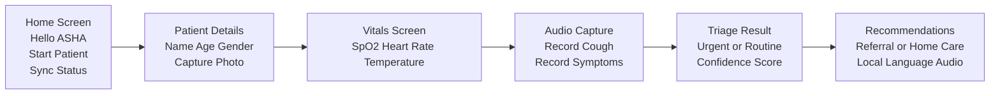

```mermaid
flowchart LR
    A[Home Screen<br/>Hello ASHA<br/>Start Patient<br/>Sync Status]

    B[Patient Details<br/>Name Age Gender<br/>Capture Photo]

    C[Vitals Screen<br/>SpO2 Heart Rate Temperature]

    D[Audio Capture<br/>Record Cough<br/>Record Symptoms]

    E[Triage Result<br/>Urgent or Routine<br/>Confidence Score]

    F[Recommendations<br/>Referral or Home Care<br/>Local Language Audio]

    A --> B
    B --> C
    C --> D
    D --> E
    E --> F


```